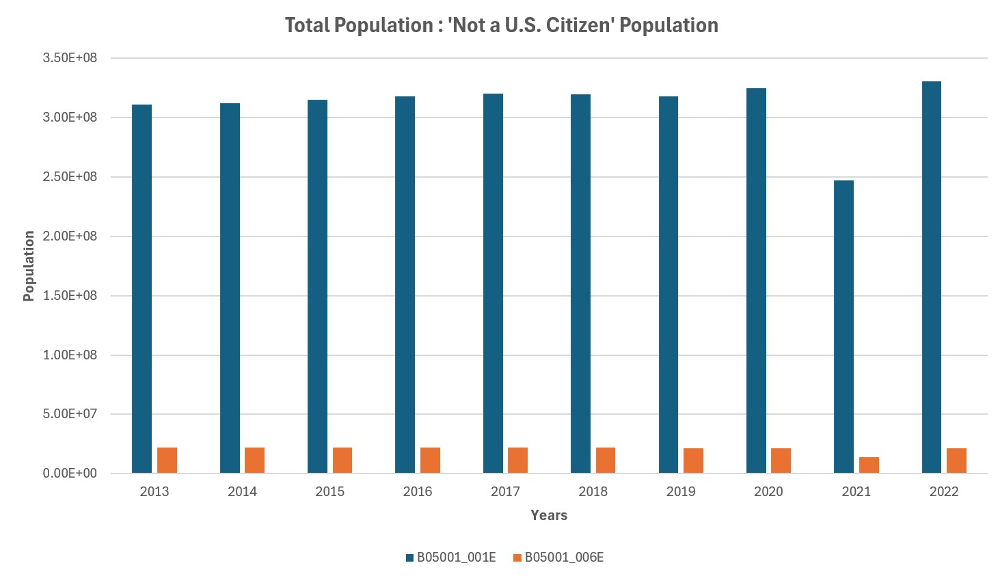
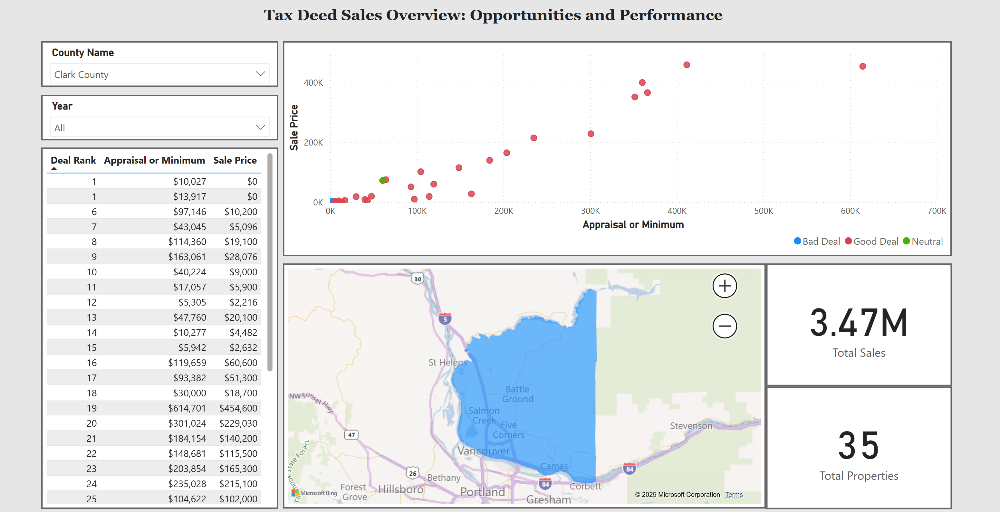

## EDUCATION

**B.A. -  UNIVERSITY OF WASHINGTON, SEATTLE, WA - 2018**  
_August 2018_  
- Bachelor of Arts in Chemistry  
- Bachelor of Arts in Medical Anthropology & Global Health  

**RELATED COURSES AND CERTIFICATIONS**  
- UW Course, HMS 520[1](https://www.washington.edu/students/crscat/hms.html): R, Version Control and Data Wrangling for Health Metrics Sciences (2020)  
- UW PCE[1](https://www.pce.uw.edu/), Python Programming: UW Python Programming I/II (2021)  
- UW PCE[1](https://github.com/chrish47-afk/chrish47-afk.github.io/blob/main/images/UW_SQL.jpeg) [2](https://www.pce.uw.edu/certificates/sql-server-database-development), Certificate in SQL Server Development (2022)  
- ChatGPT for Data Analytics with Luke Barousse (2024)  
- UW PCE[1](https://www.pce.uw.edu/certificates/big-data-technologies), Certificate in Big Data Technologies (2024-2025)  

---

## PROFESSIONAL EXPERIENCE

**Intern**  
_Institute for Health Metrics and Evaluation, Seattle, WA | January – September 2018_

  
<strong>Details</strong>

<ul>
<li>Performed Upper Respiratory Infections & Hearing Loss scientific literature screenings and extractions.</li>
</ul>

**Data Analyst / Data Extraction Analyst**  
_Institute for Health Metrics and Evaluation, Seattle, WA | October 2018 – Present_

  
<strong>Details</strong>

  
  <ul>
  <li>Conducted ad-hoc analytical work, including vetting data pipelines, creating visualizations, updating legacy code, and developing code for data verification and quality management.</li>
  <li>Managed and maintained the integrity of large data bins focused on maternal causes (both nonfatal and fatal) and infertility, ensuring data consistency across multiple datasets.</li>
  <li>Led data landscaping initiatives, identifying gaps, inconsistencies, and opportunities for enhanced data reliability in maternal health research.</li>
  <li>Experience in Scientific Literature and Microdata extractions.</li>
  <li>Ran, transformed, and developed new procedures for maternal, STI, and infertility data/code pipelines.</li>
  <li>Utilized HPC clusters and IDEs for version control and running R, STATA, and Python code.</li>
  <li>Conducted rigorous data validation and verification processes to enhance the accuracy and trustworthiness of in-house data, aligning with IHME’s standards for high-confidence data.</li>
  </ul>

---

## VENTURES AND SMALL BUSINESS

**Founder & Investor**  
_La Fresnera | December 2019 – October 2021_

  
<strong>Details</strong>

  
<ul>  
<li>Mission-driven startup for the growth of Organic Cacao Farming & Regenerative Agriculture.</li>
</ul>

**Founder & Manager**  
_Clear Peak Cleaning Services | December 2023 – Present_

  
<strong>Details</strong>

  
  <ul>
  <li>Recruited, trained, and supervised a team of cleaning staff, ensuring high standards of service and customer satisfaction.</li>
  <li>Conducted market analysis to identify growth opportunities and expand the customer base.</li>
  <li>Managed budgeting, financial planning, and expense management to ensure profitability, while outsourcing administrative duties such as payroll management.</li>
  <li>Designed and created marketing content for the company website and other platforms.</li>
  <li><a href="https://clearpeakcleaning.com" target="_blank">Visit Clear Peak Cleaning Services</a></li>
  </ul>
  

---

## QUALIFICATIONS

### **Technical Skills**
- **Programming & Data Analytics:** R (dplyr, tidyverse, ggplot2), Python (NumPy, SciPy, Pandas), SQL, Scala, Spark  
- **Data Visualization & BI Tools:** Power BI, Microsoft Applications  
- **Big Data & Cloud Platforms:** Apache Spark, Apache Hadoop, Azure Databricks, Cassandra  
- **Version Control:** Git, PowerShell  
- **Additional Tools:** Canva, Squarespace UX, BookingKoala (Website Builder), PubMed, and GHDx  

### **Small Business Management Skills**
- Experience in entrepreneurship, operations, and employee & client relations.  
- Responsible for marketing strategy, including branding and digital outreach.  
- Managed contractor vetting and hiring processes to ensure quality service delivery.  
- Maintained and optimized the company website for usability and engagement.

### **Languages**:
- English and Spanish (Native Fluency)

---

## PROJECTS
### Project: Analyzing Immigration Trends and Impacts in the U.S.
[GitHub Repository](https://github.com/chrish47-afk/census_dhs_project)
- Conducted a comprehensive analysis of U.S. immigration trends using data from the American Community Survey (ACS5) and DHS Yearbook of Immigration Statistics.
- Leveraged **Python** for data extraction, **Azure Databricks** and **Scala** for large-scale data processing, and **Excel** for validation and visualization.
- Built a robust dataset (0.7GB) containing over 350,000 records to explore demographic shifts, including the distribution of foreign-born populations and lawful permanent residents.
- Delivered insights into immigration's demographic and societal impacts, supported by clear visualizations and detailed analysis.
- Optimized scripts for efficiency and scalability while addressing data inconsistencies, creating a foundation for future research on economic and policy implications.
- **Pitfall:** Greater effort was needed to vet variable codes, leaving some questions unanswered as the focus was on building the code and pipeline.

---

### Project: Extracted and visualized Tax Deed data from public sources.
[Tax Deed Dashboard](https://app.powerbi.com/view?r=eyJrIjoiNzU0ZGYxMTgtZGJmZi00ODUwLWFkZDMtMGQ2YTUwNzNlYTJjIiwidCI6IjAxOTRiYjhiLTc4MGMtNDhkZS04YTdlLWU2YTA4MmQ1ODQ4YSIsImMiOjZ9)
[GitHub Repository](https://github.com/chrish47-afk/PowerBI/tree/main/Tax%20Deeds)
- Data: Location details, appraisal/minimum value, and sale price.
- Tools: **Python** (data extraction & processing), **Power BI** (dashboard visualization).
- Outcome: Automated data insights to enhance decision-making efficiency.

---

## Notes and Resources
[Cassandra, Hashing](https://github.com/chrish47-afk/BigData/blob/main/Databricks/Cassandra_Hashing%202025-02-17%2016_16_14.ipynb)  
[SQL Merged Notes](https://github.com/chrish47-afk/Notes_Resources/blob/main/SQL%20Merged%20Notes.docx) [A/B Testing](https://github.com/chrish47-afk/Python/blob/main/Practice_and_Roles/python_AB_testing.ipynb)
[SQL Cheatsheet](https://github.com/chrish47-afk/Notes_Resources/blob/main/SQL_Cheatsheet.xlsx)

---
